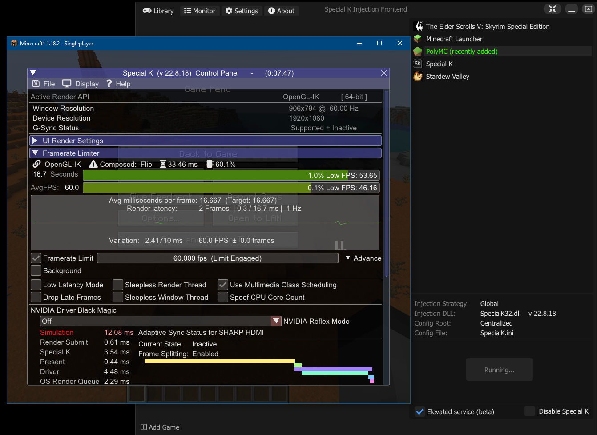
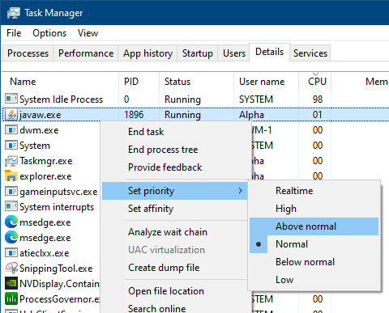

Benchmarks
======

Flags are tested with Benchmark.py script. See the work-in-progress [Benchmarks.md](https://github.com/brucethemoose/Minecraft-Performance-Flags-Benchmarks/blob/main/Benchmarks.md).

Discord: https://discord.gg/zeFSR9PnUw 

Base Java Flags
======
These optimized flags, when added to garbage collection flags, will work with any Java 17+ build. They are applicable to both servers and clients: 

```-server -XX:+UnlockExperimentalVMOptions -XX:+UnlockDiagnosticVMOptions -XX:+AlwaysPreTouch -XX:+DisableExplicitGC -XX:+UseNUMA -XX:-DontCompileHugeMethods -XX:+UseVectorCmov -XX:+PerfDisableSharedMem -XX:+UseStringDeduplication -XX:+UseFastUnorderedTimeStamps -XX:+UseCriticalJavaThreadPriority -XX:+OmitStackTraceInFastThrow -XX:ThreadPriorityPolicy=1```

Barring some *minor* differences in default flags, all OpenJDK distributions like Eclipse Adoptium, Microsoft, Azul, Amazon Correto and so on perform almost identically, with 2 major exceptions I know of: Oracle's GraalVM, and Intel's Clear Linux OpenJDK. 


Memory Allocation
======
Minimum and maximum (`-xms` and `-xmx`) values should be set to the same value, as explained here: https://dzone.com/articles/benefits-of-setting-initial-and-maximum-memory-siz

Allocating too much memory can force your operating system to page, or (without adjusting `G1NewSizePercent` to compensate) make garbage collection pauses more severe. Allocating too little can slow the game down. Less than 8GB is usually sufficient, but experiment with your mod loadout, and give Minecraft only as much as it needs.


Garbage Collection
======

Garbage Collection tuning is critical for both Minecraft servers and clients, as the "pauses" to stop and collect garbage manifest as stutters on the client and lag on servers. To minimize them, you have a few options. 

Java automatically threads garbage collection during runtume, but sometimes (especially with ZGC or Shenandoh) its best to manually set the upper limit of cores it can use with `-XX:ConcGCThreads=[Some Number]`. At the moment, I set it to ~`[number of physical cores - 1]` 

### ZGC 

ZGC is great for high memory/high core count servers. It has no throughput hit I can measure, and absolutely does not stutter like G1GC. However, it requires more RAM and more cores than other garbage collectors.

Unfortunately, it has a significant client FPS hit on my (8-core) laptop. See the "ZGC" benchmark in the benchmarks folder. 

`-XX:+UseZGC` enables it, but allocate more RAM and more `ConcGCThreads` than you normally would for other GC. Additional flags are still being investigated, but try `-XX:-ZProactive`, as we don't really care about reclaiming memory when idle.


### Shenandoah

Shenandoah performs well on clients, but kills server throughput in my tests. Enable it with `-XX:+UseShenandoahGC -XX:ShenandoahGCMode=iu -XX:ShenandoahGuaranteedGCInterval=1000000 -XX:-ShenandoahUncommit` 

See more tuning options [here](https://wiki.openjdk.org/display/shenandoah/Main). The "herustic" and "mode" options (other than "compact", which you should not use) don't seem to make much of a difference. 

If you are a Java 8 user who can't run Graal EE 21 for some reason, Red Hat builds Java 8 with Shenandoah: https://access.redhat.com/products/openjdk


## G1GC

### Client:

G1GC is Java's default collector, and is the only available garbage collector for [GraalVM users](https://github.com/oracle/graal/issues/2149). [Aikar's famous Minecraft G1GC arguments](https://aikar.co/2018/07/02/tuning-the-jvm-g1gc-garbage-collector-flags-for-minecraft/) run great on clients, with one caveat: they effectively [clamp](https://www.oracle.com/technical-resources/articles/java/g1gc.html) the `MaxGCPauseMillis` parameter, producing long stutters on some systems.

These are similar to the aikar flags, but with shorter, more frequent pauses and less aggressive G1 mixed collection: ` -XX:MaxGCPauseMillis=40 -XX:+PerfDisableSharedMem -XX:G1HeapRegionSize=16M -XX:G1NewSizePercent=23 -XX:G1ReservePercent=20 -XX:SurvivorRatio=32 -XX:G1MixedGCCountTarget=3 -XX:G1HeapWastePercent=18 -XX:InitiatingHeapOccupancyPercent=10 -XX:G1RSetUpdatingPauseTimePercent=0 -XX:MaxTenuringThreshold=1 -XX:G1SATBBufferEnqueueingThresholdPercent=30 -XX:G1ConcMarkStepDurationMillis=5 -XX:G1ConcRSHotCardLimit=16 -XX:G1ConcRefinementServiceIntervalMillis=150 -XX:GCTimeRatio=99`

I recommend using the`sparkc gcmonitor` command in the [Spark](https://www.curseforge.com/minecraft/mc-mods/spark) mod to observe G1GC pauses yourself. *Any* old generation pauses are bad, and young generation collections should be infrequent, but short enough to be imperceptible.   

`G1NewSizePercent` and `MaxGCPauseMillis` can be used to tune the frequency of young generation collections. `G1HeapWastePercent=18` should be removed if you are getting any old generation pauses on your setup. Alternatively, you can raise it and set `G1MixedGCCountTarget` to 2 or 1 to make mixed garbage collection even lazier. 


##### Server:

Longer pauses are more acceptable on servers. These flags are very close to the aikar defaults:

`-XX:MaxGCPauseMillis=150 -XX:+UnlockExperimentalVMOptions -XX:+DisableExplicitGC -XX:+AlwaysPreTouch -XX:G1NewSizePercent=30 -XX:G1HeapRegionSize=16M -XX:G1ReservePercent=20 -XX:G1MixedGCCountTarget=4 -XX:InitiatingHeapOccupancyPercent=10 -XX:G1MixedGCLiveThresholdPercent=90 -XX:G1RSetUpdatingPauseTimePercent=0 -XX:SurvivorRatio=32 -XX:MaxTenuringThreshold=1 -XX:G1SATBBufferEnqueueingThresholdPercent=30 -XX:G1ConcMarkStepDurationMillis=5 -XX:G1ConcRSHotCardLimit=16 -XX:G1ConcRefinementServiceIntervalMillis=150`


Large Pages
======

Enabling large pages improves the performance of Minecraft servers and clients. Here are some great tutorial for enabling it on Windows: 

https://www.chaoticafractals.com/manual/getting-started/enabling-large-page-support-windows
https://kstefanj.github.io/2021/05/19/large-pages-and-java.html

On Windows, you **must** run java, and your launcher, as an administrator. That means checking the ["run as administrator" compatibility checkbox](https://support.sega.com/hc/en-us/articles/201556551-Compatibility-Mode-and-Running-as-Administrator-for-PC-Games) for `javaw.exe`, `java.exe` and `your launcher.exe`, otherwise Large Pages will silently fail. Add `-XX:+UseLargePages -XX:LargePageSizeInBytes=2m` to your arguments.  

On linux, you generally want to use `-XX:+UseTransparentHugePages`. But if you want to manually allocate some server memory for Minecraft for even better performance, Red Hat has a good tutorial for RHEL-like linux distros, like Fedora, CentOS, or Oracle Linux: https://www.redhat.com/en/blog/optimizing-rhel-8-run-java-implementation-minecraft-server 


GraalVM Enterprise Edition
======

GraalVM is a new high performance Java VM from Oracle that can improve the performance of (modded) Minecraft. While client FPS gains are modest, server-side loads like chunk generation can get a 20% boost!

Unfortunately, only GraalVM Enterprise Edition comes with the full set of optimizations, and downloading it requires making a free Oracle account.

Register and download it here: https://www.oracle.com/downloads/graalvm-downloads.html

Grab the newest "Oracle GraalVM Enterprise Edition Core" release available for Java 17+ from the "Archives" section. Unzip it, and put the unzipped folder somewhere safe.

Again, you *must* use 22.1.0, not 22.2.0.

These releases are not Java installers. You need to manually replace your launcher's version of Java, or use a Minecraft launcher that supports specifying your Java path. I recommend PolyMC, ATLauncher, or GDLauncher. When specifying a java path, navigate to the "bin" folder in the GraalVM download and use "javaw.exe" or "java.exe"

For servers, you need to replace the "java" command in your server start sh/bat file with the full path to graalvm java, in quotes.

If you don't feel comfortable making an Oracle account, grab the latest [GraalVM CE release](https://github.com/graalvm/graalvm-ce-builds/releases) and use the flags from above ^. But Oracle does not check the information you put into the registration page, and GraalVM CE lacks most of the EE optimizations.

GraalVM EE Java Arguments
======

General arguments for GraalVM EE 22+ Java 17 (or Java 11):

```-server -XX:+UnlockExperimentalVMOptions -XX:+UnlockDiagnosticVMOptions -XX:+AlwaysPreTouch -XX:+DisableExplicitGC -XX:+UseNUMA -XX:-DontCompileHugeMethods -XX:+UseVectorCmov -XX:+PerfDisableSharedMem -XX:+UseStringDeduplication -XX:+UseFastUnorderedTimeStamps -XX:+UseCriticalJavaThreadPriority -XX:+OmitStackTraceInFastThrow -XX:AllocatePrefetchStyle=3 -XX:+EnableJVMCIProduct -XX:+UseJVMCICompiler -XX:+EagerJVMCI -Dgraal.TuneInlinerExploration=1 -Dgraal.CompilerConfiguration=enterprise -Dgraal.UsePriorityInlining=true -Dgraal.Vectorization=true -Dgraal.OptDuplication=true -Dgraal.DetectInvertedLoopsAsCounted=true -Dgraal.LoopInversion=true -Dgraal.VectorizeHashes=true -Dgraal.EnterprisePartialUnroll=true -Dgraal.VectorizeSIMD=true -Dgraal.StripMineNonCountedLoops=true -Dgraal.SpeculativeGuardMovement=true -Dgraal.InfeasiblePathCorrelation=true -Dgraal.LoopRotation=true```


Many of the `Dgraal` arguments are redundant/default, but are there for easy testing. Again, you must use G1GC as your garbage collector when running GraalVM CE or EE. 


GraalVM EE Mod Compatibility
======
- GraalVM 22.2.0 has issues with Minecraft, particularly with the `UsePriorityInlining` flag enabled. Please use 22.1.0 until 22.3.0 is out. See: https://github.com/oracle/graal/issues/4776

- Some flags, including `VectorizeSIMD`, turn villagers and some passive mobs invisible when running shaders through Iris or Occulus... but only after some time, and only on some setups. If this happens to you, set `VectorizeSIMD=False`. If that doesn't fix it, please let me know! See: https://github.com/oracle/graal/issues/4775

- GraalVM CE and EE both break constellation rendering in Astral Sorcery, unless JVCMI is disabled. See: https://github.com/HellFirePvP/AstralSorcery/issues/1963

If you run into any other mod issues you can trace back to GraalVM, please create a Github issue or post in the Discord!

SpecialK
======
SpecialK has 2 major performance benefits to Minecraft on Windows:

- A fancy frame limiter that reduces stutter, eliminates tearing, saves power, and saves CPU TDP to boost when needed. It even works in conjuction with VRR or Nvidia Reflex. 

- A OpenGL-to-DirectX11 wrapper called OpenGL-IK that eliminates Minecraft's windowed moded overhead, and enables other features (like HDR).

Download it here: https://wiki.special-k.info/en/SpecialK/Tools

Add your MC launcher, and check the "elevated service" checkbox. Then navigate to your java bin folder where your javaw.exe is, and create an empty file called `SpecialK.OpenGL32`. Launch your Minecraft launcher with the SpecialK launcher, and the launcher will then "inject" SpecialK into Minecraft.


Be sure to turn off VSync and the frame limiter, and (maybe) Sodium's adaptive vsync.


Process Priority
======
After launching Minecraft, set Java to run at a high process priority in Windows with the task manager:



Linux users can append the command `sudo nice -n -18` to thier launch arguments.


Other Performance Notes
======

- Minecraft client linux users should check out https://github.com/Admicos/minecraft-wayland

- I highly recommend hosting Minecraft servers (and clients!) on Clear Linux over any other Linux distro. In spite of the name, it works great on Intel and AMD CPUs/GPUs... just *not* Nvidia GPUs: https://clearlinux.org/downloads

- Close everything in the background, including Discord and your browser! Minecraft is resource intensive, and does not like other apps generating CPU interrupts or eating disk I/O, RAM and so on.  

- IBM's OpenJ9 is *extremely* slow in Minecraft. 


Java 8
======


Java 8 has not been tested as much as 17, though GraalVM 21.X alone does provide a significant uplift.

These flags will work with OpenJDK8, along with Shenandoh GC (for Red Hat OpenJDK on clients) or G1GC (for everything else):

```-server -XX:+UnlockExperimentalVMOptions -XX:+UnlockDiagnosticVMOptions -XX:+ParallelRefProcEnabled -XX:+AlwaysPreTouch -Dsun.rmi.dgc.server.gcInterval=2147483646 -XX:+PerfDisableSharedMem -XX:MaxTenuringThreshold=1 -XX:+UseStringDeduplication -XX:+UseFastUnorderedTimeStamps -XX:+UseAES -XX:+UseAESIntrinsics -XX:AllocatePrefetchStyle=1 -XX:+UseLoopPredicate -XX:+RangeCheckElimination -XX:+EliminateLocks -XX:+DoEscapeAnalysis -XX:+UseCodeCacheFlushing -XX:+UseFastJNIAccessors -XX:+OptimizeStringConcat -XX:+UseCompressedOops -XX:+UseThreadPriorities -XX:+OmitStackTraceInFastThrow -XX:ThreadPriorityPolicy=1 -XX:+UseInlineCaches -XX:+RewriteBytecodes -XX:+RewriteFrequentPairs -XX:+UseNUMA -XX:-DontCompileHugeMethods -XX:+UseFPUForSpilling -Dgraal.CompilerConfiguration=community -Dgraal.SpeculativeGuardMovement=true```

x86 Java 8 users (aka most Java 8 users) can add these additional arguments:

```-XX:+UseNewLongLShift -XX:+UseXMMForArrayCopy -XX:+UseXmmI2D -XX:+UseXmmI2F -XX:+UseXmmLoadAndClearUpper -XX:+UseXmmRegToRegMoveAll -XX:+UseNewLongLShift```

These flags work with GraalVM EE 21.X:

```-server -XX:+UnlockExperimentalVMOptions -XX:+UnlockDiagnosticVMOptions -XX:+ParallelRefProcEnabled -XX:+AlwaysPreTouch  -XX:+EnableJVMCI -XX:+UseJVMCICompiler -XX:+EagerJVMCI -XX:+UseStringDeduplication -XX:+UseFastUnorderedTimeStamps -XX:AllocatePrefetchStyle=1 -XX:+UseLoopPredicate -XX:+RangeCheckElimination -XX:+EliminateLocks -XX:+DoEscapeAnalysis -XX:+UseCodeCacheFlushing -XX:+UseFastJNIAccessors -XX:+OptimizeStringConcat -XX:+UseCompressedOops -XX:+UseThreadPriorities -XX:+OmitStackTraceInFastThrow -XX:ThreadPriorityPolicy=1 -XX:+UseInlineCaches -XX:+RewriteBytecodes -XX:+RewriteFrequentPairs -XX:+UseNUMA -XX:-DontCompileHugeMethods -XX:+UseFPUForSpilling -Dgraal.TuneInlinerExploration=1 -Dgraal.CompilerConfiguration=enterprise -Dgraal.UsePriorityInlining=true -Dgraal.Vectorization=true -Dgraal.OptDuplication=true -Dgraal.DetectInvertedLoopsAsCounted=true -Dgraal.LoopInversion=true -Dgraal.VectorizeHashes=true -Dgraal.EnterprisePartialUnroll=true -Dgraal.VectorizeSIMD=true -Dgraal.StripMineNonCountedLoops=true -Dgraal.SpeculativeGuardMovement=true -Dgraal.InfeasiblePathCorrelation=true```


Flag Explanations
======
- Aikar flags are explained here: https://aikar.co/2018/07/02/tuning-the-jvm-g1gc-garbage-collector-flags-for-minecraft/
- `-XX:+UnlockExperimentalVMOptions -XX:+UnlockDiagnosticVMOptions` simply unlock more flags to be used. These can be listed with the `-XX:+PrintFlagsFinal` and `-XX:+JVMCIPrintProperties` flags.
- `-server` tells Java to start as a throughput-optimized server, not a startup-time-optimized client. It *should* do this by default.
- `-XX:+UseNUMA` enables optimizations for multisocket systems, if applicable. Not sure if this applies to MCM CPUs like Ryzen or Epyc. 
- `-XX:-DontCompileHugeMethods` allows huge methods to be compiled. Modded Minecraft has lots of these, and we don't care about more CPU or code cache, we just want the Minecraft threads to run faster. 
- `-XX:+UseStringDeduplication` This should save a bit of memory for "free," and reducing memory is always good. It works in ZGC and G1GC in Java 18. 
- `-XX:+UseFastUnorderedTimeStamps` Avoid system calls for getting the time. The impact of this will vary per system, but we aren't really concerned with logging timestamp accuracy. 
- `-XX:+UseCriticalJavaThreadPriority` *Nothing* should preempt the Minecraft thread. GC and Compiler threads can wait. 
- `-XX:+OmitStackTraceInFastThrow` Minecraft throws a ton of "safe" errors we don't want to spend CPU tracing. 
- `-XX:ThreadPriorityPolicy=1` Hook into the OS's threading policy. Some JDKs emable this by default, but some don't.
- `-XX:G1SATBBufferEnqueueingThresholdPercent=30 -XX:G1ConcMarkStepDurationMillis=5 -XX:G1ConcRSHotCardLimit=16 -XX:G1ConcRefinementServiceIntervalMillis=150`: Optimizes G1GC's concurrent collection: https://research.spec.org/icpe_proceedings/2014/p111.pdf
- `-XX:G1RSetUpdatingPauseTimePercent=0`: We want *all* this work to be done in the conncurrent G1GC threads, not the pauses. 
- `-XX:G1HeapWastePercent=18` Don't bother collecting from old gen until its above this percent. This avoids triggering slower "mixed" young generation GCs, and is fine since Minecraft (with sufficient memory) doesn't fill the old gen that fast. Idea from: https://www.reddit.com/r/Minecraft/comments/k9zb7m/tuning_jvm_gc_for_singleplayer/
- `-XX:GCTimeRatio=99` As a goal, 1% of CPU time should be spent on garbage collection. Default is 12, which seems way too low. 
- `-XX:AllocatePrefetchStyle=3` Cache-align prefetches. This seems to break ZGC, hence its only enabled for Graal.
- `-Dgraal.LoopRotation=true` A non default optimization, will probably be default soon. 
- `-Dgraal.TuneInlinerExploration=1` Spend more time making inlining decisions. For Minecraft, we want the compiler to be as slow and aggressive as possible. 
- Most other graal arguments are enabled by default, and are either there as a sanity check, debugging or a failsafe (if, for instance, someone unknowingly disables JVCMI with some other flag). 

Flags Under Consideration:
======
- Increased code cache, but only if profiling with `-XX:+PrintCodeCache` suggests modded Minecraft fills up the code cache: https://docs.oracle.com/javase/8/embedded/develop-apps-platforms/codecache.htm
- More aggressive inlining, via `-Dgraal.BaseTargetSpending=160` (default 120) in Graal and some other flags in OpenJDK.
- Lower C2/C1 compilation thresholds and more aggresive deoptimization to compensate. Again, we don't really care about Java using more CPU for compiling since that's done in backgrounds threads. 
- Some experimental flags in Graal, like 
- These OpenJDK flags with are disabled by default for unknown reasons: `-XX:+AlignVector -XX:+RelaxAccessControlCheck -XX:+OptoScheduling -XX:+OptoBundling -XX:+OptimizeFill -XX:+AlwaysCompileLoopMethods -XX:+AlwaysActAsServerClassMachine`
- `-Dgraal.LSRAOptimization=true` (whichs seems stable so far)
- `-Dgraal.OptWriteMotion=true` and `graal.WriteableCodeCache=true`, which *do not* seem stable, but may be more stable in GraalVM 22.3.0 


Sources
======
- Updated Aikar flags from this repo: https://github.com/etil2jz/etil-minecraft-flags
- Reddit post from a Forge dev: https://www.reddit.com/r/feedthebeast/comments/5jhuk9/modded_mc_and_memory_usage_a_history_with_a/
- Red Hat's optimization guide: https://www.redhat.com/en/blog/optimizing-rhel-8-run-java-implementation-minecraft-server
- GraalVM release notes: https://www.graalvm.org/release-notes/
- Oracle's Java 17 Documentation: https://docs.oracle.com/en/java/javase/17/docs/specs/man/java.html
- VM Options explorer: https://chriswhocodes.com/
- Java itself, via the `-XX:+PrintFlagsFinal` and the `-XX:+JVMCIPrintProperties` flags to dump flag descriptions/defaults. 
- Testing from @keyboard.tn in Discord.
- https://research.spec.org/icpe_proceedings/2014/p111.pdf
- https://www.diva-portal.org/smash/get/diva2:1466940/FULLTEXT01.pdf
- https://malloc.se/blog/zgc-jdk17
